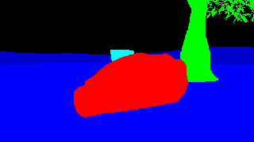
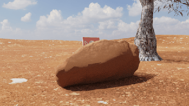
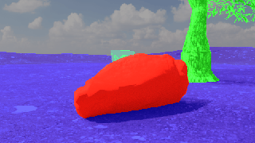

# Synthetic Image Training Data with Blender

Code for using Blender to generate synthetic image training data. This codebase is used by the VFRAME project for generating images to train object detection and image classification computer vision models for OSINT computer vision projects.

This is a prototype release. Included is a basic demo using a static scene that can be used to generate synthetic data for a danger sign. There are still many parts of the project under development so check back in a month or two for updates.

For more information on how VFRAME trains with synthetic data visit <https://vframe.io/research/synthetic-datasets/>

|Mask|Real|Composite|
|---|---|---|
||||


## Setup

- [Blender setup](docs/blender-setup.md)
- [Conda setup](docs/setup.md)

## Running Blender Scripts

The basic functions are:

```
python cli_blender.py
Commands:
  demo      Runs Blender demos and test
  generate  Runs Blender synthetic data generator
```

```
python cli_convert.py 
Commands:
  images_to_gif       Converts still image to GIF
  images_to_overlays  Composites real and mask images, writes optional video
  images_to_video     Converts still image sequence to video
  mask_to_bbox        Converts image, masks, and metadata to CSV annotations
```

## Demo

Demo shows how to generate synthetic data for a simple scene with 3 objects (sign, tree, and rock). Demo is not intended to generate actual training data, but only to show basic functionality. More demos will be published later.

### 1. Download Blender demo file 

[vframe_danger_sign_static_public.blend](https://vframe.ams3.digitaloceanspaces.com/v2/vframe_synthetic/data_store/blender/vframe_danger_sign_static_public.blend) to `data_store/blenders`

### 2. Edit config .yml

- open `configs/demo/static_sign.yml` and edit the `render:output:filepath`

### 3. Run Blender with Python Script

```
cd cli/
python cli_blender.py demo --blend ../data_store/blenders/vframe_danger_sign_static_public.blend --python app/blender/tests/camera_demo.py --config configs/demo/static_sign.yml
```

This creates a metadata.csv file. See example [metadata.csv](docs/assets/metadata.csv)

| color_b | color_g | color_r | description | label | label_index | mat_id | object_idx |
|---|---|---|---|---|---|---|---|
|255|255|0|"UXO Danger Sign| Arabic"|danger_sign|0|0|0

### 4. Generate Annotations from Metadata

`python cli_convert.py mask_to_bbox -i ../data_store/renders/demo_danger_sign`

This creates an annotations.csv file. See example [annotations.csv](docs/assets/annotations.csv)

x1|y1|x2|y2|label|label_index|filename|color
|---|---|---|---|---|---|---|---|
0.4375|0.35555555555555557|0.528125|0.43333333333333335|danger_sign|0|cam_0000_frame_0001.png|0x00ffff
0.45|0.35555555555555557|0.58125|0.6111111111111112|danger_sign|0|cam_0000_frame_0009.png|0x00ffff

### 5. Train

Not covered here. But your next step would be to convert the bounding box data to the object training framework of your choice (Darknet, PyTorch, TensorFlow, etc...)

## Visualize Results

Composite images:

```
export d=../data_store/renders/demo_danger_sign
python cli_convert.py images_to_overlays -i $d
python cli_convert.py images_to_overlays -i $d --video  # with video
python cli_convert.py images_to_overlays -i $d --video --fps 2 # at 2 FPS
```

Generate vidoes from directory of images:

```
export d=../data_store/renders/demo_danger_sign
python cli_convert.py images_to_video -i $d/comp --fps 2  # video comp
python cli_convert.py images_to_video -i $d/real --fps 2  # video real
python cli_convert.py images_to_video -i $d/mask --fps 2  # video mask
```

Animated GIF:

```
export d=../data_store/renders/demo_danger_sign
python cli_convert.py images_to_gif -i $d/comp --fps 4  # gif comp
python cli_convert.py images_to_gif -i $d/real --fps 4  # gif real
python cli_convert.py images_to_gif -i $d/mask --fps 4  # gif mask
```


## Custom Scripts

- add your custom scripts in `cli/commands/custom` to avoid conflict with future project updates 
- to run your custom scripts use `python cli_custom.py example` for example

## TODO

- Add demo for camera jittering with static system
- Add demo for world background cycling
- Add demo for ground material cycling
- Add demo for object color node cycling
- Add demo for emitter system
- Dockerize for production

## Help Wanted

- Determine how to use rigid body objects with emitter system to avoid object overlaps in hair emitter


